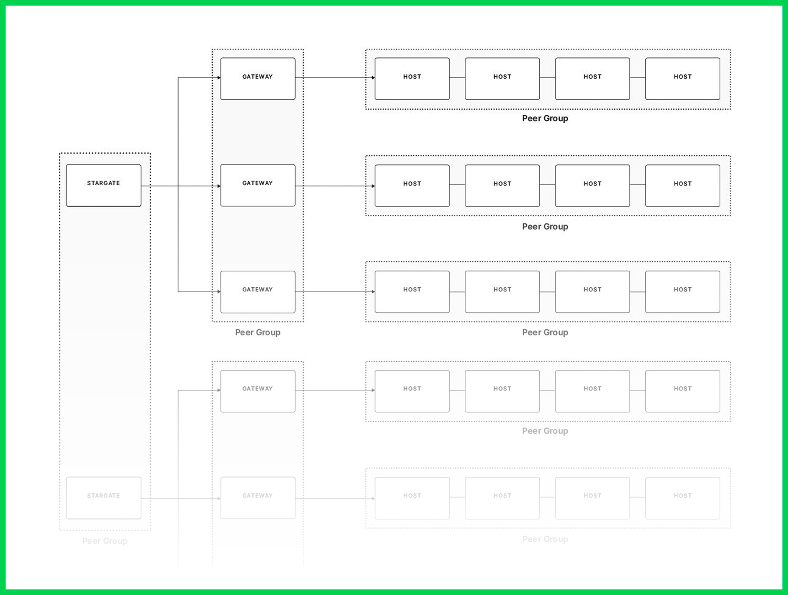

# Expected Yields

Device yields are benchmarked against proof of stake, with average yields expected to be in the region of 10% for Hosts, 15% for Gateways and 20% for Stargates.

Yield is earned in $XE, with coins emitted by the network form a fixed supply of 10m. Increasing difficulty in the network over time reduces the emitted tokens every year.

Yields are calculated based on the performance nodes relative to their peers. In this way Gateways compete with each other on the basis of network need \(where are the most jobs at any given point in time\). Beneath Gateways, Hosts compete with each other return successfully completed jobs.

This weighting is explained in more detail in the next section, but in practice it means that some nodes will return a higher yield than others. This is by design, and creates an internal network market that incentivises the addition of more nodes in high trafficked areas of the network \(New York or London for example\). It also incentivises higher performance devices \(availability, connectivity and processing power\).

