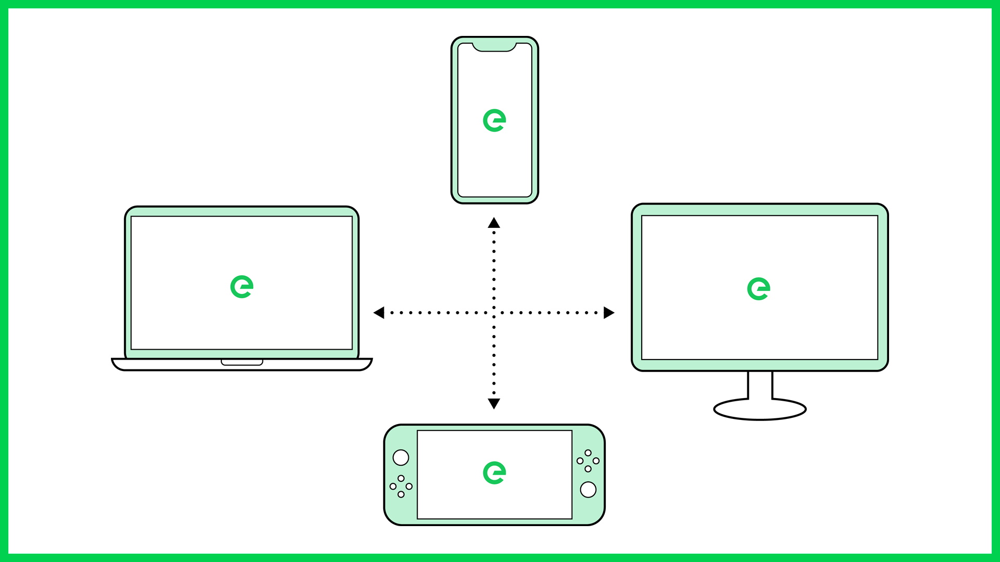
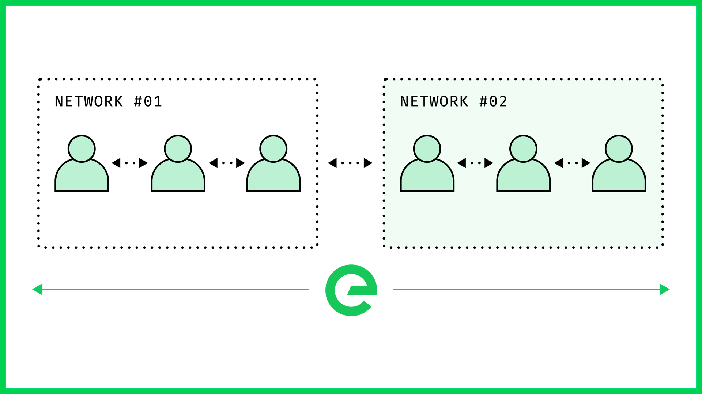
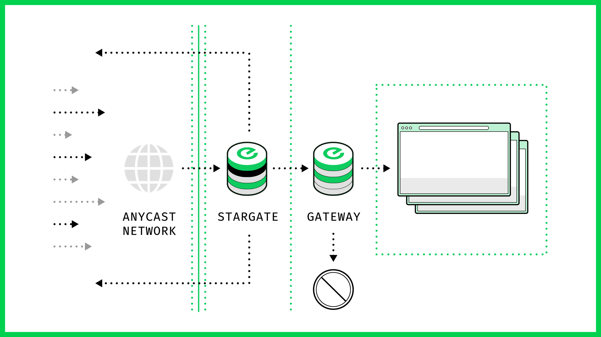
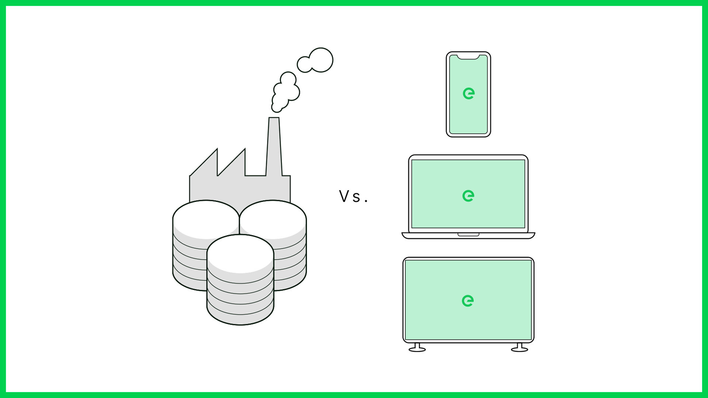

# 🌐 The Edge Network

## What is Edge Networking?

Edge networking is a distributed computing paradigm which brings data storage and computation as close to the point of need as possible, pushing applications, data and computing power away from centralised data centres.

This reduces the volumes of data that must be moved, the consequent traffic, and the distance the data must travel, providing lower latency and reduced transmission costs.

## The Edge Ledger


**The Edge (XE) Blockchain is a original chain, designed and built entirely by the core team**


The blockchain at the heart of the network records device usage and value attribution. It uses an internal coin called $XE, a layer 2 solution that provides fast transfers within the network that are fee free for value attribution. $XE includes bridging functionality that allows the coin to be bridged in to other networks. In this way $XE can be converted to $EDGE on the Ethereum network.

The genesis transaction for the XE Blockchain is imprinted with the project's mission: **The Internet Belongs to Everyone**



## Network Architecture

The network's novel architecture has multiple node types that enable the connectivity of devices in multifarious network settings.

### The Local Global Network

Edge comprises hundreds of nodes contributed by individuals and businesses around the world. It is designed to provide hyper-local processing and storage capacity for networked applications, enabling digital services that are more performant than ever before.

Edge's technology harnesses the spare capacity that exists in the devices all around us. Take for example set top boxes, which are turned on 24/7, but only in use for an average of a few hours every day. In isolation a set top box doesn’t provide that much power, but when you knit the 35 million devices installed in homes in the UK it becomes an incredibly powerful resource.

### BGP Routing

The Edge network utilizes BGP (Border Gateway Protocol) operating within network masternodes to inform top level routing decisions in the network. BGP is the protocol that makes the Internet work. It does this by enabling data routing on the Internet by looking at all of the available paths that data could take from point to point, and picking the best route.

### Internal Network Routing

Edge is network aware, and capable of routing within local networks to minimise the hops involved in any given request.

If you are a network owner or have a significant hardware estate, you can offset the cost of network services by contributing to the network. In addition, by enabling delivery within your own network, you can reduce north-south transport, effectively converting it to east-west transport between devices and end users within your own estate.

### Security

Denial of Service attacks continue to escalate in scope, becoming ever more distributed, with growing volumes of traffic. Attacks increase your cost and impact your revenues, customer experience and brand.

Edge’s layered approach to security effectively defends against DDoS attacks, preventing disruption to your core services, and keeping your apps online

## Predicted Carbon Savings

Data use and storage is growing exponentially, and with current statistics showing that only half of the world's population is connected to the Internet, it is estimated that by 2040, storing digital data is set to create 14 percent of the world's emissions. This amount is equivalent to the same proportion emitted by the USA today – 5,130 million metric tons of carbon – and has significant consequential impacts for climate change (Climate Home News, 2017; Springer Link, 2020).

By enabling sharing capacity across existing devices, Edge significantly reduces the requirement for centralised data centres and servers, removing the stored energy cost of the production of these devices. It reduces power consumption for processing and for data transmission by connecting topologically close users and providers. Edge predicts a kWh/GB saving at 58.5% versus the cloud, factoring in device and data transmission.

Edge is working to undertake a full academic study in to the carbon savings implicit in the Edge Network. This is being done in conjunction with a leading university in the United Kingdom.

## Additional Reading

These links are designed to enable you to delve deeper in to the Edge network:

* Network Coverage: [edge.network/en/global-reach](https://edge.network/en/global-reach/)
* Security: [edge.network/en/security](https://edge.network/en/security/)
* Monitoring: [edge.network/en/monitoring](https://edge.network/en/monitoring/)
* DDoS Protection: [edge.network/en/ddos-protection](https://edge.network/en/ddos-protection/)

Technology deep dives from the core team:

* Finding a Stargate: [ed.ge/knowledge/finding-a-stargate](https://ed.ge/knowledge/finding-a-stargate)
* edge-cli: Connectivity check: [ed.ge/knowledge/edge-cli-connectivity-check](https://ed.ge/knowledge/edge-cli-connectivity-check)
* Gateway Bi-Directional Streaming: [ed.ge/knowledge/gateway-bi-directional-streaming](https://ed.ge/knowledge/gateway-bi-directional-streaming)
* Edge SSL: [ed.ge/knowledge/edge-ssl](https://ed.ge/knowledge/edge-ssl)
* An Introduction to Telemetry: [ed.ge/knowledge/an-introduction-to-telemetry](https://ed.ge/knowledge/an-introduction-to-telemetry)
* Finite State Machine: [ed.ge/knowledge/finite-state-machine](https://ed.ge/knowledge/finite-state-machine)
* Edge Storage Deep Dive: [ed.ge/knowledge/edge-storage-deep-dive](https://ed.ge/knowledge/edge-storage-deep-dive)
* Scaling the Edge: [ed.ge/knowledge/scaling-the-edge](https://ed.ge/knowledge/scaling-the-edge)
* Managing Stakes with Edge CLI: [ed.ge/knowledge/managing-stakes-with-edge-cli](https://ed.ge/knowledge/managing-stakes-with-edge-cli)

Top level concepts and vision:

* A Fairer Internet: [ed.ge/knowledge/a-fairer-internet](https://ed.ge/knowledge/a-fairer-internet)
* The Local, Global Network: [ed.ge/knowledge/the-local-global-network](https://ed.ge/knowledge/the-local-global-network)
* The Network Under Your Nose: [ed.ge/knowledge/the-network-under-your-nose](https://ed.ge/knowledge/the-network-under-your-nose)
* The Cloud Is Not Enough: [ed.ge/knowledge/the-cloud-is-not-enough](https://ed.ge/knowledge/the-cloud-is-not-enough)
* Hidden in Plain Sight: [ed.ge/knowledge/hidden-in-plain-sight](https://ed.ge/knowledge/hidden-in-plain-sight)
* The Network That Works for You: [ed.ge/knowledge/the-network-that-works-for-you](https://ed.ge/knowledge/the-network-that-works-for-you)
* Cleaning Up the Cloud: [ed.ge/knowledge/cleaning-up-the-cloud](https://ed.ge/knowledge/cleaning-up-the-cloud)
* The New Media Platform: [ed.ge/knowledge/the-new-media-platform](https://ed.ge/knowledge/the-new-media-platform)
